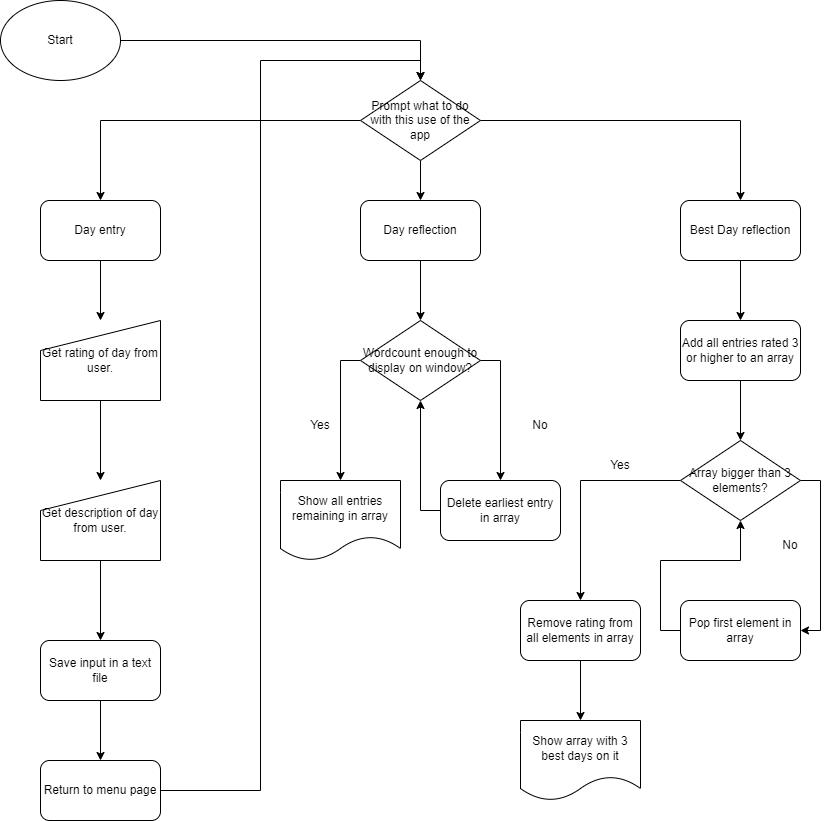

# Mental Out

Mental health is a serious issue for our generation and many times it seems that it doesn't get as much recognition as it should for how big of an issue it is. From my experiences, one of the best ways to deal with depression is just simply talking. So MentalOut is a self oriented mental health app in which you can just talk about your day, rate it, and then look back on some of your recent days as well as your best days in case you current one hasn't gone so well.

Logic flow diagram:

There is an exe located in the dist folder, however I'm not sure on whether or not the exe is on the latest version but it has a functional version of the app.
