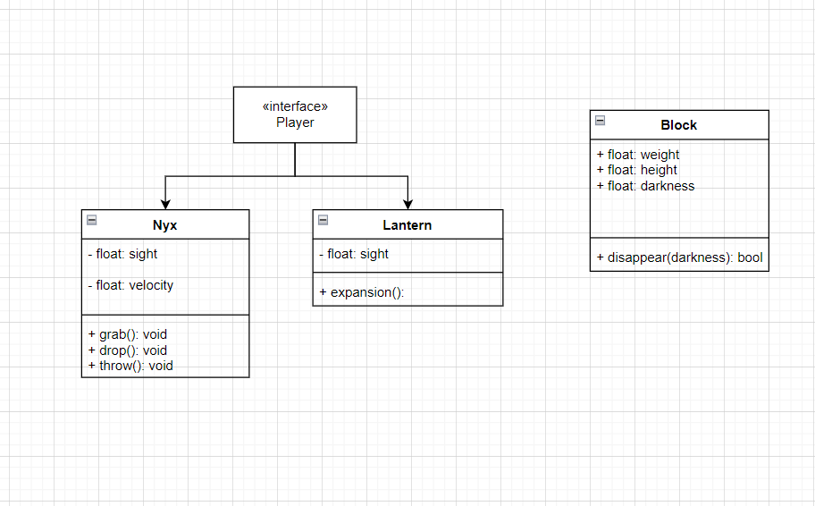

# NearSight

I wanted to make a platoformeresque style of game where the main mechanic is related to what you can see. Enter NearSight, the puzzle platformer where what you can not see is just as important as what you can. It follows our main characters, Nyx, a cat with terrible eyesight, and the Lantern, a spirit that guides Nyx throughout the city. Can you use your sight and mind to figure out how to get home? Or will you be consumed by the night?

